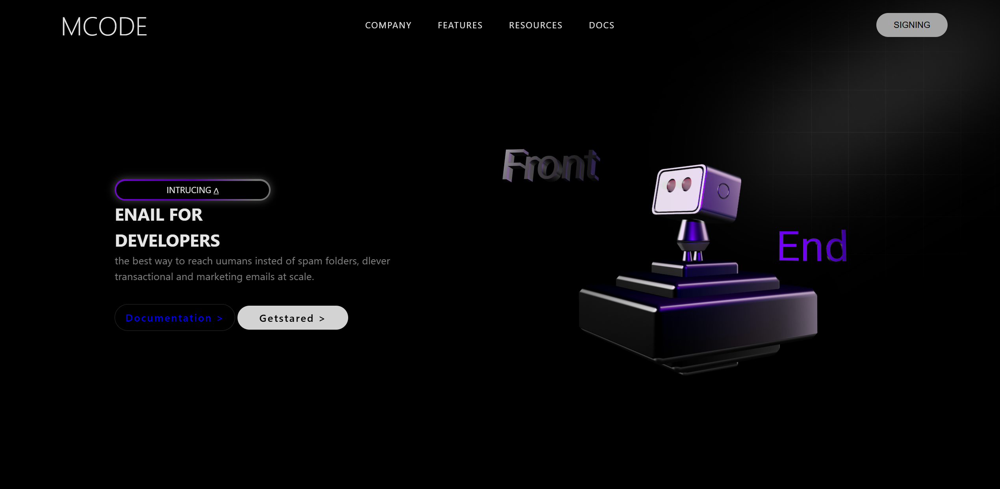

# MCODE Landing Page



## Descrição
Este é um **site responsivo** desenvolvido para apresentar a MCODE, com foco em desenvolvedores. O site conta com animações modernas e interatividade para proporcionar uma experiência visual agradável.

## Funcionalidades
- **Responsivo**: O layout se adapta para diferentes tamanhos de tela, incluindo desktops, tablets e dispositivos móveis.
- **Animações**: Todas as seções possuem efeitos de animação suaves usando AOS (Animate on Scroll).
- **Interatividade 3D**: É possível interagir com o modelo 3D do robô, girando-o em múltiplas direções clicando sobre ele.
- **Elementos visuais**: Fundo com gradiente e blur para dar profundidade e destaque ao conteúdo.

## Tecnologias Utilizadas
- **HTML5**  
- **CSS3**  
- **JavaScript**  
- **AOS** – Animações ao scroll  
- **Spline Viewer** – Modelo 3D interativo

## Estrutura do Projeto
```
├── index.html
├── styles/
│   └── style.css
├── img/
│   └── image.png
│   └── gradient.png
└── README.md
```

## Como Usar
1. Clone o projeto:
   ```bash
   git clone <URL_DO_REPOSITORIO>
   ```
2. Abra o arquivo `index.html` no seu navegador favorito.
3. Interaja com o robô 3D e explore as animações e efeitos visuais.

## Captura de Tela


## Observações
- Certifique-se de estar conectado à internet para carregar corretamente os scripts externos (AOS e Spline Viewer).  
- Para uma melhor experiência em dispositivos móveis, utilize a tela na orientação vertical.

---

Site desenvolvido com foco em **design moderno, responsividade e interatividade**.

